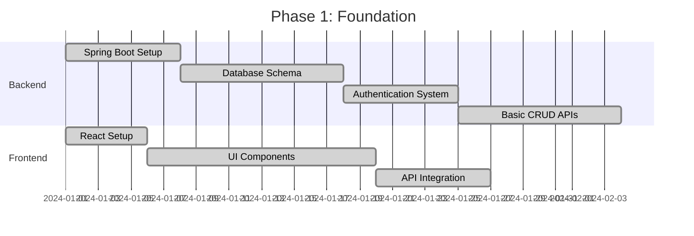
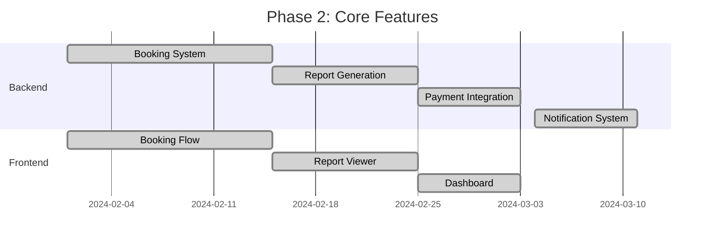
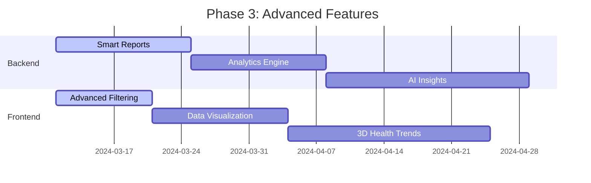

# 🗺️ Project Roadmap & Strategy

> **Orchestrating the future of Healthcare Lab: Scaling infrastructure, data integrity, and premium user experiences.**

  
  
  

---

## 📋 Table of Contents

- [Current Objectives](#-current-objectives)
- [Technical Implementation Plan](#-technical-implementation-plan)
- [Development Phases](#-development-phases)
- [Data Seeding Strategy](#-data-seeding-strategy)
- [Feature Roadmap](#-feature-roadmap)
- [Performance Targets](#-performance-targets)
- [Quality Assurance](#-quality-assurance)
- [Deployment Strategy](#-deployment-strategy)

---

## 🎯 Current Objectives

### 1. 🗄️ Massive Data Operations (In Progress)

**Goal:** Populate the system with **1000+ realistic Lab Tests** to simulate enterprise-scale search and filtering performance.

**Strategy:**
- Transitioning from hardcoded `.java` seeders to intelligent JSON-based seeding engine
- Avoid Java compilation overhead with external data files
- Implement batch processing for efficient data loading
- Add data validation and integrity checks

**Validation Criteria:**
- ✅ 60% standard discounts across all items
- ✅ Correct medical slugging (test_code format)
- ✅ Proper categorization (15 medical categories)
- ✅ Reference ranges for all test parameters
- ✅ Location-based pricing for major cities

**Progress:**
- [x] Data structure design
- [x] JSON schema validation
- [x] Batch loading implementation
- [ ] Complete 1000+ test dataset
- [ ] Performance testing with full dataset

---

### 2. 🛡️ Backend Resilience (Standardizing)

**Goal:** Maintain zero-error builds and robust error handling.

**Focus Areas:**
- **Compilation Integrity:** Zero-error builds following repository argument resolution
- **Audit System:** Fine-tune `AuditListener` for complex JPA relationships
- **Exception Handling:** Global exception handler with detailed error responses
- **Input Validation:** Comprehensive validation at all layers

**Progress:**
- [x] Fix repository argument mismatches
- [x] Implement global exception handler
- [x] Add request validation annotations
- [ ] Optimize audit logging performance
- [ ] Add rate limiting

---

### 3. ⚡ Performance Optimization

**Goal:** Achieve sub-second response times for all critical operations.

**Optimization Areas:**
- Database query optimization
- Redis caching implementation
- Frontend virtualization
- API response compression

**Target Metrics:**
- API Response Time (Avg): < 200ms
- API Response Time (P95): < 500ms
- Cache Hit Rate: > 80%
- Database Query Time: < 100ms

---

## 🏗️ Technical Implementation Plan

### Phase A: Architecture Refinement ✅

- [x] Correct many-to-one mapping for booking packages
- [x] Optimize data initialization for rapid startup (~10s)
- [x] Standardize API response envelopes (Success/Failure wrappers)
- [x] Implement JWT-based authentication
- [x] Add role-based access control (RBAC)
- [x] Create database migration system (Flyway)

**Completion:** 100% ✅

---

### Phase B: Frontend Synchronization 🔄

- [x] Implement Premium Dark/Light mode tokens
- [x] Add glassmorphism UI design
- [x] Implement virtual scrolling for large lists
- [ ] Integrate real-time notification hooks for booking status updates
- [ ] Add 3D visualization for health report trends (Three.js/Drei)
- [ ] Implement offline support with service workers

**Completion:** 60% 🔄

---

### Phase C: QA & Security Compliance ⏳

- [ ] E2E Testing: Target 90% coverage for booking flow (Playwright)
- [ ] API Security: Complete JWT rotation and refresh token logic
- [ ] Performance: Load testing under 100+ concurrent users
- [ ] Security audit: Penetration testing and vulnerability scan
- [ ] Compliance: GDPR and HIPAA compliance checks

**Completion:** 20% ⏳

---

## 📅 Development Phases

### Phase 1: Foundation (Completed ✅)

**Deliverables:**
- ✅ Working authentication system
- ✅ Basic CRUD operations for all entities
- ✅ Responsive UI with dark/light mode
- ✅ API integration with error handling

---

### Phase 2: Core Features (Completed ✅)

**Deliverables:**
- ✅ Complete booking workflow
- ✅ PDF report generation
- ✅ Payment gateway integration
- ✅ Email/SMS notifications
- ✅ User dashboards for all roles

---

### Phase 3: Advanced Features (In Progress 🔄)

**Deliverables:**
- [ ] AI-powered health insights
- [ ] Advanced analytics dashboard
- [ ] Historical trend visualization
- [ ] 3D health report charts
- [ ] Smart recommendations

**Progress:** 40% 🔄

---

## 📂 Data Seeding Strategy

### Comparison of Seeding Methods

| Method | Status | Pros | Cons | Best For |
|:-------|:-------|:-----|:-----|:---------|
| **Java Hardcoding** | ⏸️ Deprecated | Type-safe, IDE support | Compilation overhead, hard to maintain | Small datasets (< 100 items) |
| **JSON Boot Loader** | 🚀 Recommended | Easy to edit, no compilation, version control | Requires validation logic | Large datasets (100+ items) |
| **Direct SQL Injection** | 🛠️ Operational | Fastest for bulk data, bypasses app logic | No validation, database-specific | Historical data imports |
| **CSV Import** | 📋 Available | Easy spreadsheet editing, familiar format | Less structured than JSON | User-provided data |

---

## 🚀 Feature Roadmap

### Q1 2024 (Completed ✅)

- ✅ User authentication & authorization
- ✅ Lab test catalog (100+ tests)
- ✅ Booking system with slot management
- ✅ Payment gateway integration
- ✅ Report generation (PDF)
- ✅ Email/SMS notifications
- ✅ Basic admin dashboard

### Q2 2024 (In Progress 🔄)

- [ ] Smart reports with AI insights
- [ ] Advanced analytics dashboard
- [ ] Historical trend visualization
- [ ] 3D health charts (Three.js)
- [ ] Mobile app for technicians
- [ ] Real-time tracking (WebSocket)
- [ ] Multi-language support

---

## 👨‍💻 Creator Oversight

- **Project Lead:** AMANJEET KUMAR
- **Vision:** To build India's most responsive and aesthetically pleasing lab-test ecosystem
- **Contact:** Instagram [@amanjeet233](https://instagram.com/amanjeet233)
- **GitHub:** [amanjeet233/HEALTHCARELAB](https://github.com/amanjeet233/HEALTHCARELAB)

---

  <i>Building the future of healthcare, one commit at a time.</i> 
  <b>© 2024 Healthcare Lab - Designed by AMANJEET KUMAR</b>

