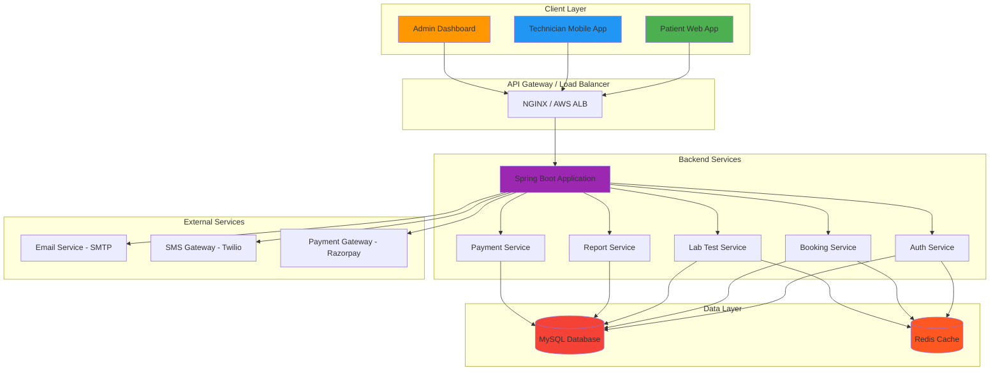
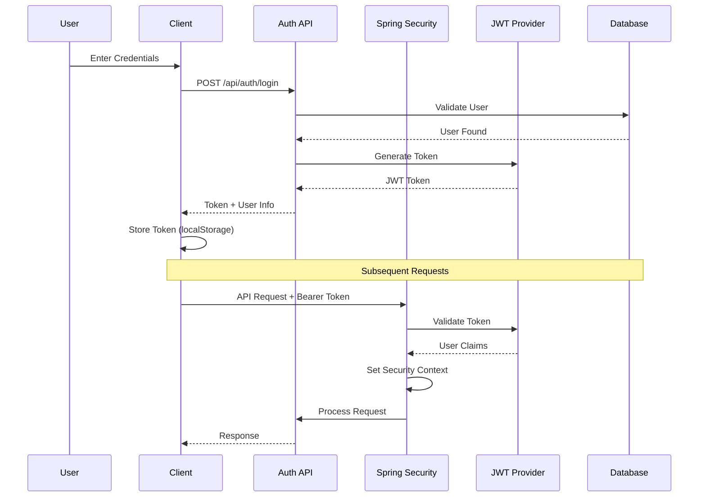
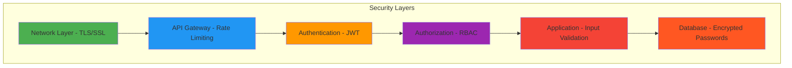

# 🏛️ System Architecture

> **The high-performance, scalable backbone of the Healthcare Lab Ecosystem.**

  
  
  

---

## 📋 Table of Contents

- [Core Architecture Overview](#-core-architecture-overview)
- [Technology Stack](#-technology-stack)
- [System Architecture Diagram](#-system-architecture-diagram)
- [Data Flow Architecture](#-data-flow-architecture)
- [Booking Lifecycle Flow](#-booking-lifecycle-flow)
- [Authentication & Security](#-authentication--security)
- [Database Schema Design](#-database-schema-design)
- [API Layer Design](#-api-layer-design)
- [Frontend Architecture](#-frontend-architecture)
- [Caching Strategy](#-caching-strategy)
- [Scalability Design](#-scalability-design)
- [Deployment Architecture](#-deployment-architecture)

---

## 🏗️ Core Architecture Overview

Healthcare Lab is structured as a modern **Decoupled Full-Stack Application**, utilizing a high-efficiency Java Spring Boot backend and a lightning-fast React + Vite frontend. The system is designed to handle thousands of concurrent bookings and millions of test records with sub-second response times.

### 🎯 Architecture Principles

| Principle | Description | Implementation |
|-----------|-------------|----------------|
| **Separation of Concerns** | Clear boundaries between layers | Controller → Service → Repository |
| **Stateless Authentication** | JWT-based, no server-side session | Spring Security + JWT Filter |
| **Data Consistency** | ACID transactions for critical operations | Spring @Transactional |
| **Performance First** | Caching, indexing, query optimization | Redis, Database Indexes, JPQL |
| **Scalability** | Horizontal scaling ready | Stateless design, Docker support |

---

## 🛠️ Technology Stack

### 🍃 Backend (The Engine)

| Component | Technology | Version | Purpose |
|-----------|-----------|---------|---------|
| **Framework** | Spring Boot | 3.3.x | Application framework |
| **Language** | Java | 21 LTS | Core programming language |
| **ORM** | Hibernate / Spring Data JPA | 3.3.x | Database abstraction |
| **Security** | Spring Security + JWT | 6.2.x | Authentication & authorization |
| **Database** | MySQL | 8.0+ | Primary data store |
| **Caching** | Redis | 7.0+ | In-memory caching layer |
| **Build Tool** | Maven | 3.9+ | Dependency management |
| **API Docs** | SpringDoc OpenAPI | 2.3.0 | Interactive documentation |

**Key Backend Features:**
- ✅ Intelligent database seeding (500+ lab tests)
- ✅ Role-based access control (RBAC)
- ✅ Audit logging for all critical operations
- ✅ Exception handling with global error handler
- ✅ Validation with Bean Validation API

---

### ⚛️ Frontend (The Experience)

| Component | Technology | Version | Purpose |
|-----------|-----------|---------|---------|
| **Framework** | React | 19 | UI framework |
| **Build Tool** | Vite | 5.x | Fast development & build |
| **Language** | TypeScript | 5.x | Type-safe JavaScript |
| **Styling** | Tailwind CSS | v4 | Utility-first CSS |
| **Animations** | Framer Motion | 11.x | Smooth UI transitions |
| **State Management** | React Context + Hooks | - | Global state |
| **HTTP Client** | Axios | 1.x | API communication |
| **Forms** | React Hook Form | 7.x | Form management |
| **Virtualization** | React Window | 1.x | Large list performance |

**Key Frontend Features:**
- ✅ Premium Dark/Light mode with Tailwind
- ✅ Glassmorphism UI design
- ✅ Virtual scrolling for 1000+ items
- ✅ Real-time status updates
- ✅ Responsive design (mobile-first)

---

### 🗄️ Database (The Memory)

| Component | Technology | Version | Purpose |
|-----------|-----------|---------|---------|
| **Primary DB** | MySQL | 8.0+ | Relational data storage |
| **Caching Layer** | Redis | 7.0+ | Session & result caching |
| **Connection Pool** | HikariCP | 5.1.0 | Database connection pooling |
| **Migration** | Flyway | 9.x | Database version control |

**Database Features:**
- ✅ 31 optimized indexes across 16 tables
- ✅ Foreign key constraints for data integrity
- ✅ Soft delete support
- ✅ Audit timestamps (created_at, updated_at)
- ✅ Query optimization with JPQL

---

## 🏗️ System Architecture Diagram

---

## 🔒 Authentication & Security

### JWT Authentication Flow

### Security Layers

**Security Measures:**

| Layer | Mechanism | Purpose |
|-------|-----------|---------|
| **Network** | TLS 1.3 | Encrypt data in transit |
| **API Gateway** | Rate Limiting (100-1000 req/min) | Prevent DDoS attacks |
| **Authentication** | JWT + BCrypt (strength: 10) | Secure identity verification |
| **Authorization** | @PreAuthorize annotations | Role-based access control |
| **Input Validation** | Bean Validation + Custom Validators | Prevent injection attacks |
| **Database** | Encrypted passwords, SQL parameterization | Protect stored data |
| **Audit Logging** | AuditListener | Track all critical operations |

---

## 👨‍💻 Strategic Oversight

- **Chief Architect:** AMANJEET KUMAR
- **Mission:** High availability, zero latency, and beautiful healthcare logic
- **Contact:** Instagram [@amanjeet233](https://instagram.com/amanjeet233)

---

  <i>"Architecture is the foundation of trust in healthcare software."</i> 
  <b>Built with precision for modern healthcare infrastructure.</b>

