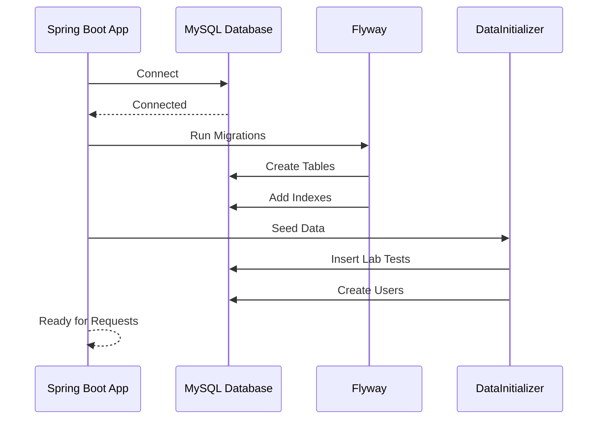

# ⚡ Quick Start Guide

> **Rapid guide to initialize data and get started with Healthcare Lab.**

<div align="center">
  
</div>

---

## 📊 Data Initialization

### Automatic Data Seeding

On first startup, the system automatically seeds:

1. **100+ Lab Tests** across 15 medical categories
2. **Test Parameters** with reference ranges
3. **4 Test Users** for all roles (Patient, Technician, Doctor, Admin)
4. **Test Packages** with bundled tests

### Test Users

| Email | Password | Role |
|-------|----------|------|
| `patient@test.com` | password123 | PATIENT |
| `technician@test.com` | password123 | TECHNICIAN |
| `doctor@test.com` | password123 | MEDICAL_OFFICER |
| `admin@test.com` | password123 | ADMIN |

---

## 🚀 Startup Sequence



---

## ✅ Verification

Check MySQL to verify data:

```sql
-- Check lab tests count
SELECT COUNT(*) FROM lab_tests;

-- Check users
SELECT email, role FROM users;
```

---

<div align="center">
  <b>✅ Data initialization complete. Ready to use!</b>
</div>
